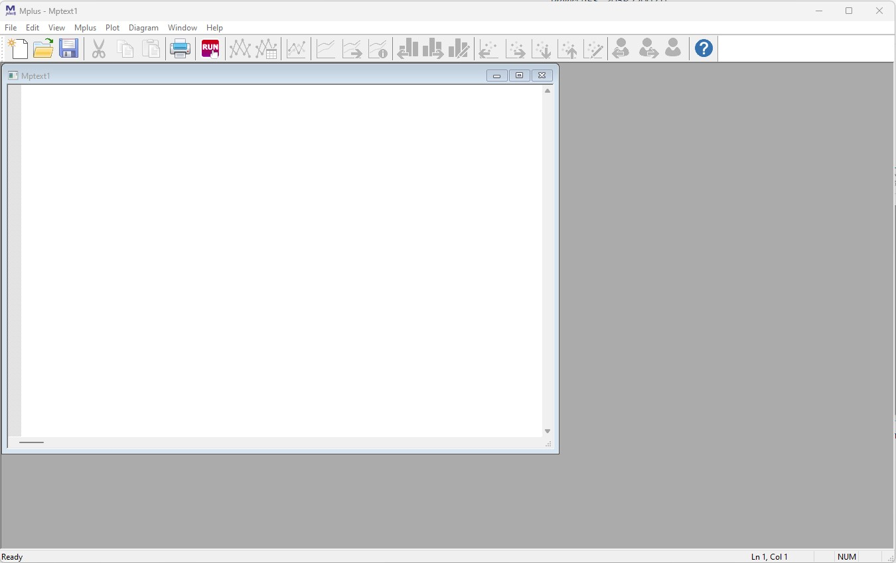
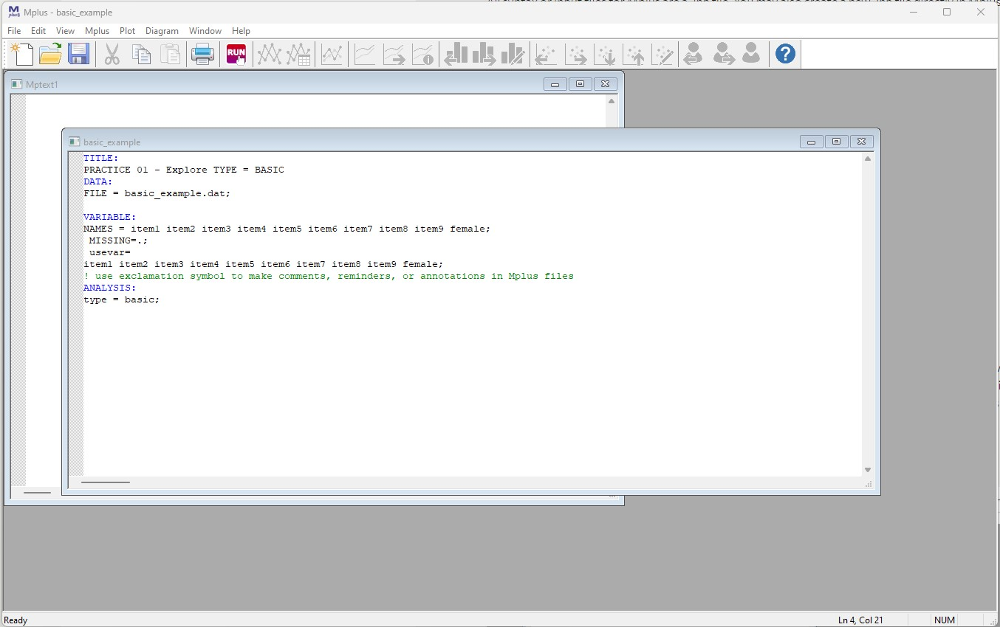
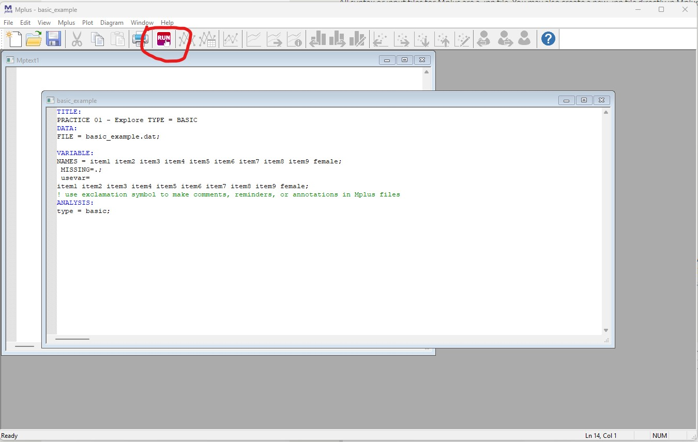

## Video tutorial repository: "intro-to-mplusautomation"

- - -

### An Introduction to R and RStudio

#### IMMERSE Project: Institute of Mixture Modeling for Equity-Oriented Researchers, Scholars, and Educators

#### Video Series Funded by IES Training Grant (R305B220021)

#### *Dina Arch*

- - -

{width="200"}

The Institute of Mixture Modeling for Equity-Oriented Researchers, Scholars, and Educators (IMMERSE) is an IES funded training grant (R305B220021) to support education scholars in integrating mixture modeling into their research.

{style="float: left;" width="300"}

-   Please [visit our website](https://immerse.education.ucsb.edu/) to learn more and apply for the year-long fellowship.

-   Visit our [GitHub](https://github.com/immerse-ucsb) account to download the materials needed for this walkthrough.

-   Follow us on [Twitter](https://twitter.com/IMMERSE_UCSB)!


How to reference this: *This work was supported by the IMMERSE Project* (IES - 305B220021).

------------------------------------------------------------------------

# Introduction to `MplusAutomation`

This introduction will go through how to use Mplus and MplusAutomation in R.
For Part 1, we will first walk through how to run basic descriptive statistics using only Mplus.
In Part 2, we will use an R package called MplusAutomation to run the same analysis as Part 1, only this time using only RStudio.
Part 3 will go over data cleaning in R.

Additional MplusAutomation resources can be found <span style="text-decoration:underline">[here](https://immerse.education.ucsb.edu/)</span> 

------------------------------------------------------------------------

## PART 1: Introduction to Mplus

------------------------------------------------------------------------

### Step 1: Open Mplus



This is the Mplus interface.
Even though we will NOT be working directly in Mplus, it is good to get an idea of how Mplus works.

------------------------------------------------------------------------

### Step 2: Open Mplus input file located in the project folder



Open the file titled `basic_example.inp` located in the `part1_mplus` folder in Mplus.
All syntax or input files for Mplus are a *.inp* file.
You may also create a new *.inp* file directly in Mplus and populate the syntax there.
For now, we can use one that is already complete.

-   Basic skeleton of an Mplus *.inp* syntax

    -   **TITLE:** title of our document

    -   **DATA:** data file (must be in the same folder as the *.inp*)

    -   **VARIABLE:**

        -   **NAMES =** names of each variable in order of each column

        -   **MISSING** = what the missing data is labeled as

        -   **USEVAR =** names of the variable actually being used in the analysis

    -   **ANALYSIS:**

        -   **TYPE =** this section is what will change constantly based on your model. For now, we are running "type = basic" which will provide us descriptive statistics of our variables.

**NOTE:** Please view the data file that is provided in this lab (basic_example.dat).
Mplus works with .dat files to run analyses.
The dataset must also be formatted in certain way in order for Mplus to read it (i.e., no variable names)

### Step 3: Click Run



This will run our "type=basic" analysis which will provide us a *.out* file that contains variables descriptive statistics of our variables.
MPplus will save this *.out* file in the folder that dataset is located (in our case `part1_mplus`. All *.out* and *.inp* files can be open as a text file if you want to access them off without Mplus.

------------------------------------------------------------------------

## PART 2: Introduction to RStudio

In Part II, we will obtain the same Mplus *.out* file that we produced in Part I using RStudio.
This is done using the [`MplusAutomation`](https://michaelhallquist.github.io/MplusAutomation/) package (Hallquist & Wiley, 2018).
`MplusAutomation` is an R package communicates with Mplus to replicate the process we went through above using Rstudio and R language.

### WHAT is `MplusAutomation` & WHY should we use it?

**WHAT?**

-   `MplusAutomation` is an `R` package
-   It "wraps around" the `Mplus` program
-   Requires both `R` & `Mplus` software
-   Requires learning some basics of 2 programming languages
-   Car metaphor: R/Rstudio is the *steering wheel or dashboard* & Mplus is the *engine*

**WHY?**

-   `MplusAutomation` can provide clearly organized work procedures in which every research decision can be documented in a single place
-   Increase reproducibility, organization, efficiency, and transparency

**HOW?**

-   The interface for MplusAutomation is entirely within R-Studio. You do not need to open Mplus
-   The code presented will be very repetitive by design


### Step 1: Open RStudio


Open R studio on your desktop.
You don't need to close Mplus.
**IMPORTANT**: Because we are using a package that communicates with Mplus, we *must* use have Mplus installed to run Rstudio.

### Step 2: Create a new R-project


R-projects help us organize our folders , filepaths, and scripts.
To create a new R project:

-   File --\> New Project...

Click "New Directory" --\> New Project --\> Name your project (Perhaps "Intro to MplusAutomation")

Before you click "Create Project," save your project.
It'll save as a folder.
**THIS IS IMPORTANT.** If your file path is too long (longer than 90 characters), Mplus cuts off the filepath and will not run your syntax.
Move all the materials found on Github into this new project folder you created.

### Step 3: Create an R-markdown document


An R-markdown file provides an authoring framework for data science that allows us to organize our reports using texts and code chunks.
This document you are reading was made using R-markdown!
Lets create an R-markdown and write script to run a "type=basic" analysis using the R package, `MplusAutomation`.

To create an R-markdown:

-   File --\> New File --\> R Markdown...

In the window that pops up, give the R-markdown a title such as "**Introduction to MplusAutomation**" Click "OK." You should see a new markdown with some example text and code chunks.
We want a clean document to start off with so delete everything from line 10 down.
Go ahead and save this document.

### Step 4: Load packages

Your first code chunk in any given markdown should be the packages you will be using.
To insert a code chunk, etiher use the keyboard shortcut ctrl + alt + i or Code --\> Insert Chunk or click the green box with the letter C on it.
There are a few packages we want our markdown to read in:

```{r}
library(MplusAutomation)
library(tidyverse) #collection of R packages designed for data science
library(here) #helps with filepaths
library(haven) # read_sav()
library(psych) # describe()
library(ggpubr) # ggdensity() and ggqqplot()
library(corrplot) # corrplot()
here::i_am("intro-to-mplusautomation.Rmd")
```

As a reminder, if a function does not work and you receive an error like this: `could not find function "random_function"`; or if you try to load a package and you receive an error like this: `` there is no package called `random_package` `` , then you will need to install the package using `install.packages("random_package")` in the console (the bottom-left window in R studio).
Once you have installed the package you will *never* need to install it again, however you must *always* load in the packages at the beginning of your R markdown using `library(random_package)`, as shown in this document.
Once it is installed, it doesn't need to be installed again.

### Step 5: Read in data set

Recall that our data set that we used earlier is a *.dat* file with no variable names.
Remember that this is a data set specifically designed for Mplus.
Let grab the original one (an SPSS file) in the `data` folder within the `part2_rstudio` folder.

```{r}
data <- read_sav(here("part2_rstudio", "data", "explore_lab_data.sav"))

# Ways to view data in R:
# 1. click on the data in your Global Environment (upper right pane) or use...
View(data)
# 2. summary() gives basic summary statistics & shows number of NA values
# *great for checking that data has been read in correctly*
summary(data)
# 3. names() provides a list of column names. Very useful if you don't have them memorized!
names(data)
# 4. head() prints the top x rows of the dataframe
head(data)
```

You can also look at the dataframe with labels and response scale meta-data:

```{r}
sjPlot::view_df(data)
```

This SPSS dataset gives us more information than the *.dat* one.
We are able to see the variable names, and descriptions.

**Convert from *.sav* to *.csv***

It's a good idea to convert *.sav* files to *.csv*.
Here is how to convert the ***.sav*** **to *.csv***:

```{r}
# write_csv saves a .csv version of your dataset to your working directory.
# Enter the name of the object that contains your data set (in this case, "exp_lab1_data.csv"), then enter the name you want to save your dataset as. We can call it the same thing: "screen1.csv"
write_csv(data, here("part2_rstudio", "data", "exp_lab1_data.csv"))

# read the unlabeled data back into R
data_csv <- read_csv(here("part2_rstudio", "data", "exp_lab1_data.csv"))
```

**Optional: Convert from *.csv* to Mplus *.dat* file**

Say you want an Mplus .dat file and don't want to go through the hassle of deleting rows and manual conversion to *.dat*.
You can use the `prepareMplusData()` function to convert from *.csv* to *.dat*.

```{r}
prepareMplusData(data_csv, here("part2_rstudio", "data", "exp_lab1_data.dat"))
```

### Step 6: Using `MplusAutomation`

To run a basic model using `MplusAutomation` we used the `mplusObject()` function and the `mplusModeler()` function.

**What does the** `mplusObject()` **function do?**

1\.
It generates an Mplus input file (does not need full variable name list, its automated for you!) 2.
It generates a datafile specific to each model 3.
It runs or estimates the model (hopefully) producing the correct output.
Always check!

**What does the** `mplusModeler()` **function do?**

1.  Creates, runs, and reads Mplus models created using `mplusObject()`
2.  You can specify where you want the *.out* file saved
3.  `check=TRUE` checks for missing semicolons, `run=TRUE` runs the model, `hashfilename=FALSE` does not add a hash of the raw data to the datafile name.

```{r, echo=TRUE, eval=FALSE}
m_basic  <- mplusObject(
  
  TITLE = "PRACTICE 01 - Explore TYPE = BASIC;",
  
  VARIABLE = 
 "usevar= item1 item2 item3 item4 item5 item6 item7 item8 item9 female;",
  
  ANALYSIS = 
 "type = basic; ",
 
  usevariables = colnames(data_csv), 
  rdata = data_csv)

m_basic_fit <- mplusModeler(m_basic, 
               dataout=here("part2_rstudio", "basic.dat"),
               modelout=here("part2_rstudio", "basic.inp"),
               check=TRUE, run = TRUE, hashfilename = FALSE)
```

**NOTE**: You don't need to specify `MISSING` here since it automatically detects the missing value from the data set.
You also don't need `NAMES` as it detects the names from the data set.

**Optional: Subsetting observations**

You can use Mplus syntax to explore descriptives for observations reported as "female."

Add line of syntax: `useobs = female == 1;`

```{r,echo=TRUE, eval=FALSE}
fem_basic  <- mplusObject(
  
  TITLE = "PRACTICE 02 - Explore female observations only;", 
  
  VARIABLE = 
  "usevar = item1 item2 item3 item4 item5 item6 item7 item8 item9;
  useobs = female == 1; !include observations that report female in analysis",
  
  ANALYSIS = 
    "type = basic;",
 
  usevariables = colnames(data_csv), 
  rdata = data_csv)

fem_basic_fit <- mplusModeler(fem_basic, 
               dataout=here("part2_rstudio", "fem_basic.dat"),
               modelout=here("part2_rstudio", "fem_basic.inp"),
               check=TRUE, run = TRUE, hashfilename = FALSE)

```

After running an `MplusObject` function, MplusAutomation will generate an output file (same one we did before).
ALWAYS check your output before moving forward with your analyses.
It's easy to skip past checking our output since MplusAutomation doesn't automatically present it to us after running the code.
It's good practice to make it a habit to check your output file after every run.

------------------------------------------------------------------------

## PART 3: Data Cleaning & Screening

It's important to explore your data before running your analyses. First, lets rename our variables to something more meaningful using `rename()`.
As a reminder, use the pipe operator `%>%` to create a sequence of functions, you can use the shortcut crt + shift + m:

```{r}
new_names <- data_csv %>%
  rename(school_motiv1 = item1,
         school_motiv2 = item2,
         school_motiv3 = item3,
         school_comp1 = item4,
         school_comp2 = item5,
         school_comp3 = item6,
         school_belif1 = item7,
         school_belif2 = item8,
         school_belif3 = item9)
```

### Descriptive Statistics

Let's look at descriptive statistics for each variable using `summary()`:

```{r}
new_names %>% 
  summary() 
```

Alternatively, we can use the `psych::describe()` function to give more information:

```{r}
new_names %>% 
  describe()
```

What if we want to look at a subset of the data?
For example, what if we want to see those who identify as female?
We can use `tidyverse::filter()` to subset the data using certain criteria.

```{r}
new_names %>% 
  filter(female == 1) %>% 
  describe()

#You can use any operator to filter: >, <, ==, >=, etc.
```

### Missing Values

Let's check for missing values.
First, how are missing values identified?
They could be `-999`, `NA`, or literally anything else.
The simplest way to do this is to look back at the `summary()` function.
There are four variables with one missing value.

```{r}
new_names %>% 
  summary() 

# summary(new_names)
```

### Recode Continuous Variable into Factor

What if you want to recode a continuous variable into different levels (e.g., high, medium, and low)?
Let's use the variable `school_belief1` as an example.
First, let's recall the descriptives:

```{r}
new_names %>% 
  select(school_belif1) %>% 
  summary() 
```

Here, we can see that the values range from 1 - 10.
Lets recode the variable to look like this:

|        |        |
|--------|--------|
| Low    | 1 - 3  |
| Medium | 4 - 6  |
| High   | 7 - 10 |

We use `cut()` to divide continuous variables into intervals:

```{r}

school_factor <- new_names %>% 
  mutate(school_factor = cut(school_belif1,
                      breaks = c(0, 3, 6, 10), #Use 0 at the beginning to ensure that 1 is included in the first break, then break by last number in each section (3, 6, 10) 
                      labels = c("low", "medium", "high")))
# View summary
school_factor %>% 
  select(school_belif1, school_factor) %>% 
  summary() 
```

### Normality and Distributions

It's important to inspect the distribution of the data.
Many analyses are sensitive to violations of normality so in order to make sure you are confident that our data are normal, there are several things we can look at: density plots, histograms, QQ plots, box plots, scatterplots, and the descriptives such as skewness and kurtosis.
Normally, we would want to inspect every variable, but for demonstration purposes, lets focus on the `school_belif1` variable.

#### Density Plots

A density plot is a visualization of the data over a continuous interval.
As we can see by this density plot, the variable `school_belif1` is positively skewed.

```{r}
ggdensity(new_names$school_belif1, fill = "lightgray")
```

#### Histogram

A histogram provides the same information as the density plot but provides a count instead of density on the x-axis.

```{r}
hist(new_names$school_belif1, col = 'lightgray')
```

#### QQ Plots

QQ plot, or quantile-quantile plot, is a plot of the correlation between a sample and the normal distribution.
In a QQ plot, each observation is plotted as a single dot.
If the data are normal, the dots should form a straight line.
If the data are skewed, you will see either a downward curve (negatively skewed) or upward curve (positively skewed).

```{r}
ggqqplot(new_names$school_belif1)
```

As you can see in this QQ plot, there is an upward curve, which further tells us that we have a positively skewed variable.

#### Box Plots

Box plot can show us distributions, specifically the minimum, first quartile, median, third quartile, and maximum.

```{r}
new_names %>% # 
  ggplot(aes(y = school_belif1)) +
  geom_boxplot() 
```

#### Bivariate Scatterplots

We can use `pairs()` to look at bivariate scatterplots.
Do the relationships look linear?:

```{r}
pairs(new_names)

# Or we can look at individual scatterplots:
new_names %>% 
  ggplot(aes(school_belif1, school_belif2)) +
  geom_point() +
  geom_smooth(method = "lm", se =F) +
  theme_minimal()
```

We can also use `cor()` to look at bivariate correlations for the entire data set (Note: Missing values are not allowed in correlation analyses, use `drop_na()` to do listwise deletion):

```{r}
new_names %>% 
  drop_na() %>% #remove missing data
  cor(method = "pearson") %>% 
  round(2) # round to 2 decimal places 

# A colorful plot:
f_cor <- cor(new_names, use = "pairwise.complete.obs")
corrplot(f_cor,
         method="number",
         type = "upper")

#Fun tip: `apa.cor.table()` creates an APA formated correlation matrix and saves it to your computer
#apa.cor.table(physics, filename = "cor_table.doc")
```

#### Skewness and Kurtosis

One final thing to look are the skewness and kurtosis values in the descriptive statistics provided earlier.
There are many different sources that provide different cut-off values, but as a general rule of thumb, skewness and kurtosis values greater than +3/-3 indicate a non-normal distribution.
Positive skew values indicate positively skewed variables and negative skew values indicate negatively skewed variables.
Positive values of kurtosis indicate leptokurtic distributions, or higher peaks with taller tails than a normal distribution.
Negative values of kurtosis indicate platykurtic distributions, or flat peaks with thin tails.

```{r}
describe(new_names$school_belif1)
```

Here we can see that the *skew* value is less than 3 and the *kurtosis* value is less than 3, indicating a normal distribution.

------------------------------------------------------------------------

## References

Hallquist, M. N.
& Wiley, J. F.
(2018).
MplusAutomation: An R Package for Facilitating Large-Scale Latent Variable Analyses in Mplus.
Structural Equation Modeling, 25, 621-638.
doi: 10.1080/10705511.2017.1402334.

Muthén, L.K.
and Muthén, B.O.
(1998-2017).
Mplus User's Guide.
Eighth Edition.
Los Angeles, CA: Muthén & Muthén

R Core Team (2017).
R: A language and environment for statistical computing.
R Foundation for Statistical Computing, Vienna, Austria.
URL <http://www.R-project.org/>

Wickham et al., (2019).
Welcome to the tidyverse.
Journal of Open Source Software, 4(43), 1686, <https://doi.org/10.21105/joss.01686>

------------------------------------------------------------------------


